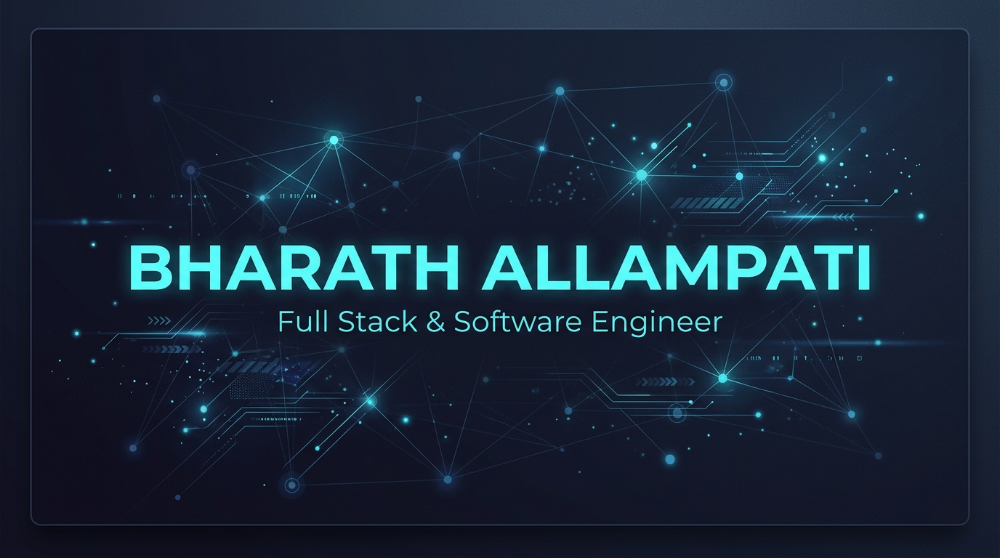

  

## Hi there 👋

I'm **Bharath Kumar Reddy Allampati**

  

A Computer Science graduate from **VIT, Class of 2026**, focused on building full-stack applications and strengthening my software engineering skills.

* 🔭 **I'm currently working on:**
  * 🎓 [GateLabs](https://github.com/bharathreddy55/GateLabs) — AI-Powered GATE CS & IT Preparation Platform (CBT Simulator, Gemini AI, Chart.js)
    * *Design Rationale:* Integrates Gemini 1.5 Flash to handle unstructured student questions and complex mathematical concept clarification where static databases fall short.
  * 🎙️ [AetherCast-MERN](https://github.com/bharathreddy55/AetherCast-MERN) — Podcast Streaming Service (Supabase Auth, Waveforms, Gemini AI)
    * *Design Rationale:* Implements Supabase ES256 key signing to prevent hotlinking and unauthorized media bandwidth consumption.
  * 🎟️ [SeatSync](https://github.com/bharathreddy55/SeatSync) — High-Concurrency Ticket Booking System (Spring Boot, Kafka, Redis locks)
    * *Design Rationale:* Engineered using a microservices pattern specifically to practice and demonstrate distributed transaction management (Saga pattern), event streaming (Kafka), and Redis-based concurrency locking.
* 🌱 **I'm currently learning:** Java Streams, Multithreading, JDBC, Spring Boot, and modern backend development
* 💻 **I work with:**
  * **Languages:**    
  * **Backend:**    
  * **Frontend:**   
  * **Databases & Cache:**    
  * **DevOps & Cloud:**     
* 🎯 **I'm focused on:** Java Full Stack Development and Software Engineering
* 📫 **Reach me at:**
  * 📧 [bharath02032508@gmail.com](mailto:bharath02032508@gmail.com)
  * 💼 [LinkedIn](https://www.linkedin.com/in/bharath-allampati-cse/)
  * 🌐 [Portfolio](https://bharath-reddy-mu.vercel.app/)

---

### 📂 Other Repositories & Projects

* 🧠 [QuizMe](https://github.com/bharathreddy55/Quiz---Me) — Online examination platform with sentiment analysis and recommendation system (Spring MVC, MySQL)
  * *Design Rationale:* Leverages sentiment analysis of user textual feedback to evaluate platform friction and recommend topic updates.
* ☁️ [Smart Queue Alert System](https://github.com/bharathreddy55/Smart-Queue-Alert-System) — Person detection and crowd alert system using AWS S3 and AWS Rekognition (Python, Google Colab)
  * *Design Rationale:* Built as a lightweight, serverless computer vision proof-of-concept (PoC) in Google Colab to verify AWS Rekognition feasibility before production backend deployment.
* 🔒 [Digital Watermarking](https://github.com/bharathreddy55/Digital-Watermarking-Images) — Image ownership verification and watermark embedding (Python, NumPy, OpenCV)
  * *Design Rationale:* Implements pixel-level image processing to study data-hiding robustness against compression attacks.

---

### 🎓 Certifications

* 🏆 **Oracle Certified:** OCI Generative AI Professional (Score: 96%)
* 💼 **Full Stack Web Development Internship:** Pantech Prolabs

---

### 📊 GitHub Streak

  

